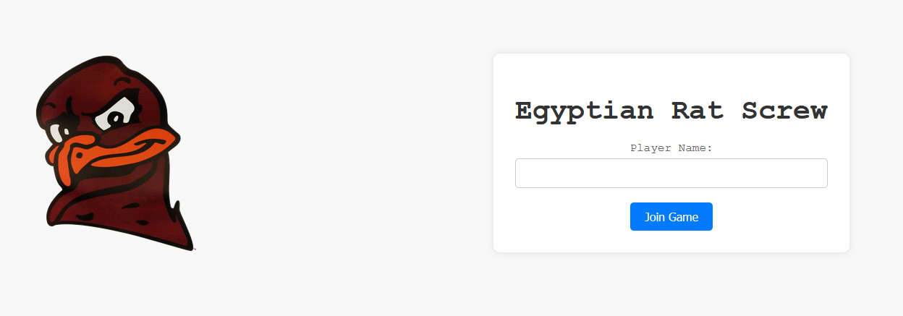
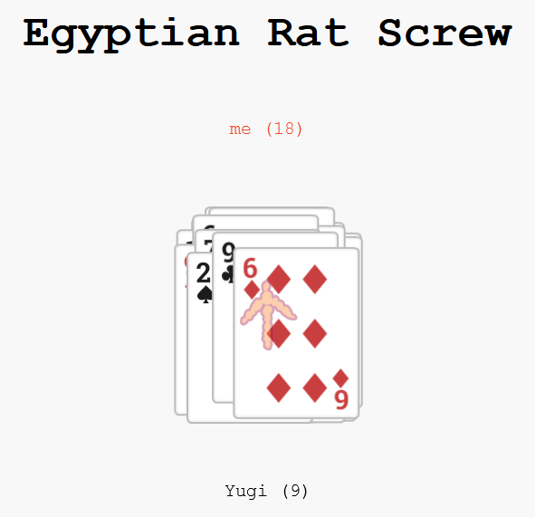

# Online Hokie Egyptian Rat Screw

This repository contains the resources for my Network Application Design final project—a Hokie-themed version of the classic card game, Egyptian Ratscrew. Play online with friends and enjoy the fast-paced action!

# Title Screen

____________________
### **Imported Libraries:**

**socket.io**: Enables real-time communication between clients and http server

**howler.core.min:** Manages the slap audio effect 

--------------------
# **Game Rules:**

1. The gameplay goes as follows, players take turns playing cards face-up into a central pile. The goal is to slap the pile when certain combinations of cards appear. The combinations that trigger a slap include:

* **Double:** When two cards of the same rank are played consecutively (Ex. two Aces).

* **Sandwich:** When a card of one rank is played with two cards of another rank between them (Ex. King, Ace, King).
                           
* **Marriage:** When a Queen is played followed by a King, or vice versa.

* **Three in a Row:** When three cards with consecutive ranks are played  (Ascending/Descending)

2. When the valid combination appears, any player can slap the pile. The first player to slap the pile after a valid combination is played wins the pile and adds it to their own stack of cards.
3. If a player slaps the pile when no valid combination is present, they must give one card from their stack to the bottom of the middle pile.
4. The game continues until one player accumulates all the cards. That player is declared the winner.

## Install Requirements:
Run the following command in your terminal to install the necessary Python packages:

`pip install -r requirements.txt`

## Run Server: 
Navigate to the final_project-ers directory and start the game server by running:

`py game_server.py`

## Join Server
When the server starts, it will display an address after "_Running on_". Open a web browser and paste that address to join the game.
### Ex:
`Running on http://127.0.0.1:8080/ (Press CTRL+C to quit)`

### Note: The game requires two or more players to start. Once you join, create a player name to get started.

# **CONTROLS:**
When it is your turn, your player name turns red, and you will be able to make one of the following moves:
* **SPACE:** To slap when an appropriate combination of card is placed
* **W / Up Arrow:** To place a card
* **S / Down Arrow:** To retrieve won cards

# Mid-game SLAP!

